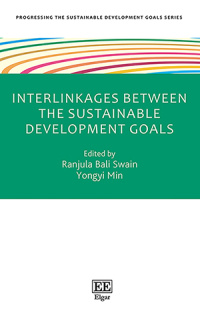
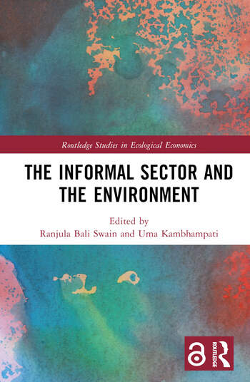
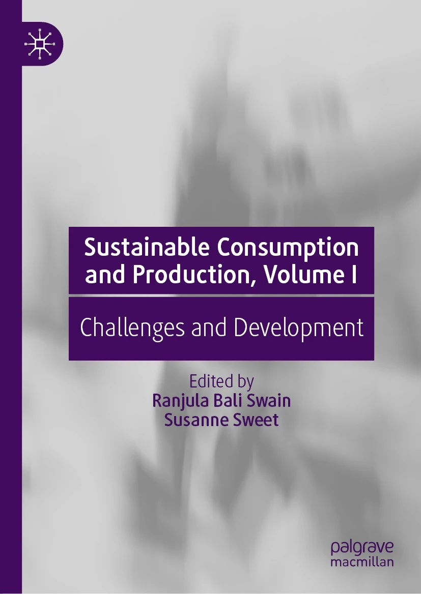
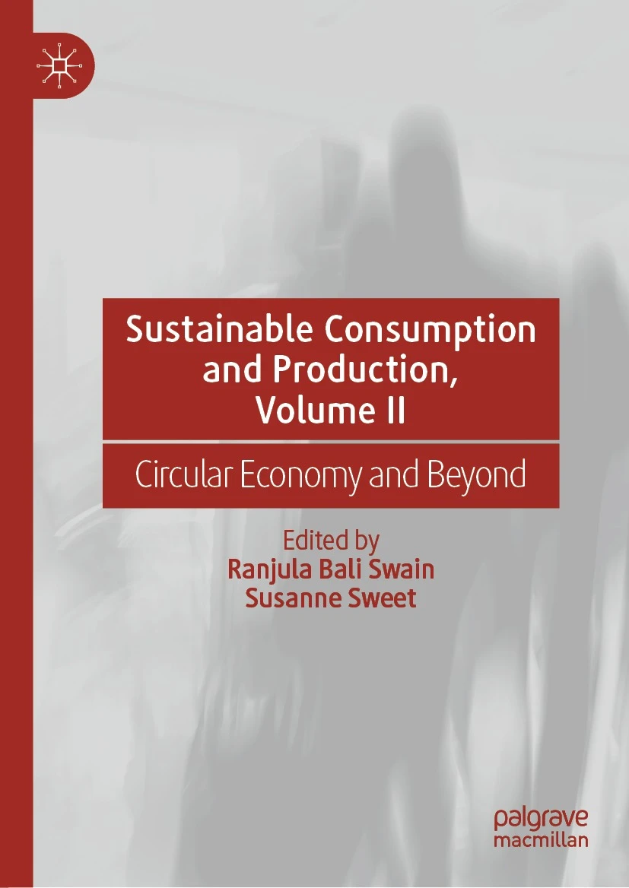
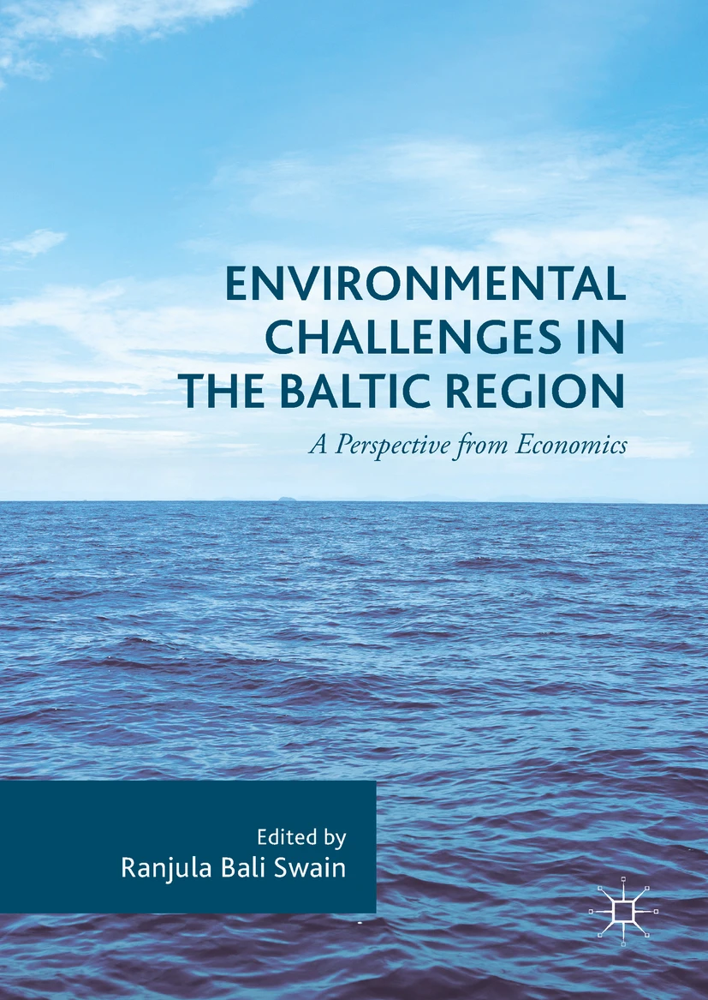
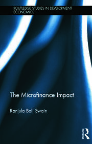
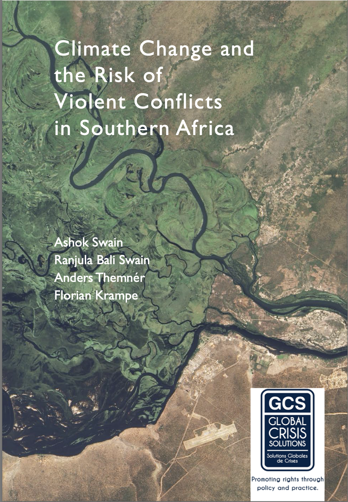
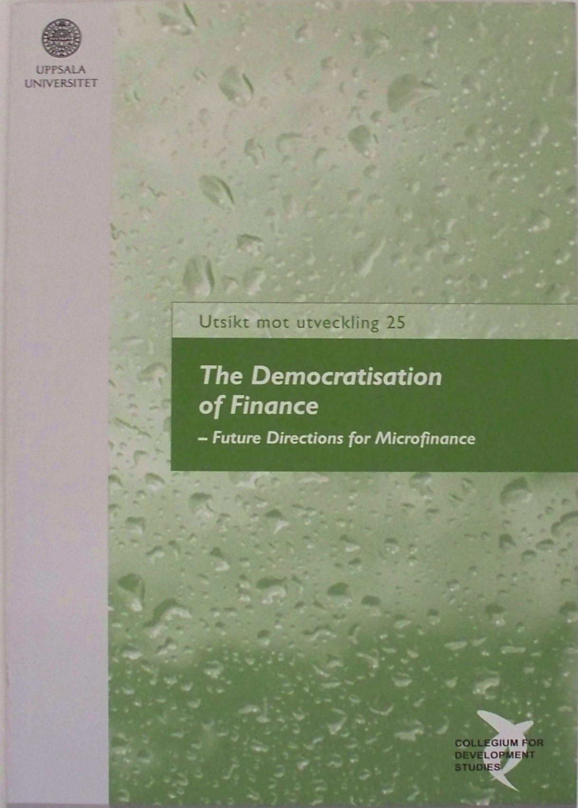
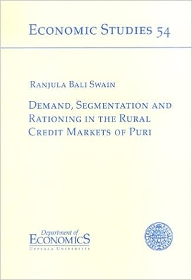



  
*  

* Bali Swain, R. and Min, Y. (eds) [Interlinkages between the Sustainable Development Goals](https://www.e-elgar.com/shop/gbp/interlinkages-between-the-sustainable-development-goals-9781803924939.html),Progressing the Sustainable Development Goals series, Edward Elgar, UK, 2023.  

   

* Bali Swain, R. and Kambhampati, U. (eds) [The Informal Sector and the Environment](https://www.routledge.com/The-Informal-Sector-and-the-Environment/Swain-Kambhampati/p/book/9781032122663), Taylor and Francis Books: Routledge, London, 2022. [News](https://www.hhs.se/en/about-us/news/csr/2022/new-book-on-the-informal-sector-and-the-environment-by-csrs-ranjula-bali-swain-and-university-of-readings-uma-kambhampati/)

   

* Bali Swain, R. and Sweet, S. (eds) [Sustainable Consumption and Production (Volume I): Development and Challenges](https://www.palgrave.com/gp/book/9783030563707), Palgrave Macmillan, London, 2021. [EU Green Week Book launch](https://www.hhs.se/en/research/centers/csr/news/sustainable-consumption-and-production-circular-economy--development---eu-green-week-2021-partner-event/)

   
     
* Bali Swain, R. and Sweet, S. (eds) [Sustainable Consumption and Production (Volume II): Beyond Circular Economy](https://www.palgrave.com/gp/book/9783030552848), Springer/Palgrave Macmillan, London, 2020. [News](https://www.hhs.se/en/research/centers/csr/news/new-book-published-by-ranjula-bali-swain-and-susanne-sweet-on-sustainable-consumption-and-production-volume-ii-circular-economy-and-beyond/)

   

* Bali Swain, R. (ed) [Environmental Challenges in the Baltic Region](https://www.palgrave.com/gp/book/9783319560069), Palgrave Macmillan, Springer London, 2017. [News](https://www.hhs.se/en/about-us/news/sir/2017/new-book-from-misumssirs-ranjula-bali-swain/)

   

* Bali Swain, R. [The Microfinance Impact](https://www.routledge.com/The-Microfinance-Impact/Swain/p/book/9781138808379), Taylor and Francis Books: Routledge, London and New York, 2012. 

   

* Swain, A., Bali Swain, R., Themner, A. and Krampe, F. [Climate Change, Natural Resource Governance and Conflict Prevention in Africa: A Scoping Study of the Zambezi River](https://uu.diva-portal.org/smash/get/diva2:419221/FULLTEXT01.pdf), Global Crisis Solutions, Pretoria, South Africa, 2011.

   

* Bali Swain, R. and E. Liljefrost (ed) [The Democratisation of Finance: Future Directions for Microfinance](https://www.amazon.com/Democratisation-Finance-Directions-Microfinance-utveckling/dp/9197470597), Utsikt mot utveckling 25, Collegium for Development Studies, Uppsala University, 2005.

   

* Bali Swain, R. Demand, [Segmentation and Rationing in the Rural Credit Markets of Puri](http://www.diva-portal.org/smash/record.jsf?pid=diva2%3A169655&dswid=-6334), Economic Studies 54, Department of Economics, Uppsala University, 2001.

